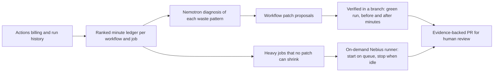

# Cirujano: Verified CI Cost Surgery

[](https://github.com/juan294/cirujano/actions/workflows/ci.yml)
[](LICENSE)


Cirujano reads GitHub Actions billing and run history, ranks where the
minutes go, proposes and verifies workflow patches that cut cost without
cutting coverage, and moves heavy jobs onto on-demand Nebius runners that
start when jobs queue and stop when idle. It opens evidence-backed PRs with
before and after minutes and never auto-merges.

"Cirujano" means surgeon. Its sibling [Sutura](https://github.com/juan294/sutura)
repairs CI that is red; Cirujano cuts the cost of CI that is green. Both are
GitHub Actions built for the Nebius x NVIDIA Global AI Hackathon, as separate
entries.

## Status

Day 0. The repository was bootstrapped on 2026-09-08 with the measurement
core, a CLI that estimates the billable minutes of one run, and an Action that
reports them. The audit, patch proposal, verification, and Nebius runner
stages are not implemented yet. The measured starting point that motivates
the project is in
[docs/research/2026-09-08-github-actions-cost-baseline.md](docs/research/2026-09-08-github-actions-cost-baseline.md).

## How it works



Three movements:

1. **Diagnose.** Rank billable minutes by repository, workflow, job, and
   trigger. Billable minutes are computed the way GitHub bills them: each
   job's wall-clock time rounded up to the next minute. The `timing`
   endpoint is not used because it reports zero on current GitHub.
2. **Prescribe and verify.** For each waste pattern, propose a concrete
   workflow patch, apply it in a branch, run the workflow, and measure the
   billed minutes before and after. Only a green run with a measured saving
   becomes a PR.
3. **Relocate.** Move jobs that cannot be shrunk onto a Nebius VM that the
   tool provisions, starts when jobs queue, and stops when idle.

## Runtime roles

| Service | Runtime role |
| --- | --- |
| NVIDIA Nemotron on Nebius Token Factory | Explains each waste pattern from workflow YAML and run history and drafts the patch. |
| Nebius AI Cloud | Hosts the on-demand runner VMs. |
| GitHub Actions API | Source of runs, jobs, and timings; target of the verified PRs. |

## Security boundary

- Workflow files, run logs, and billing data are untrusted input.
- Cirujano never merges, never deletes tests, and never weakens a check to
  make a workflow cheaper. A patch that removes coverage is rejected.
- GitHub and Nebius credentials are secrets and never enter evidence
  artifacts. Private repository names and billing screenshots are never
  committed to this public repository.
- Creating or starting a Nebius VM is billable and requires owner
  authorization.

## Install

Cirujano is not published yet. To try the measurement core from source:

```bash
git clone https://github.com/juan294/cirujano.git
cd cirujano
pnpm install
pnpm run build
gh api repos/OWNER/REPO/actions/runs/RUN_ID/jobs > jobs.json
node packages/cli/dist/bin.js estimate --jobs jobs.json
```

## Contributor setup

Requires Node 22 or newer and pnpm 11.

```bash
pnpm install
pnpm run typecheck
pnpm run lint
pnpm run test
pnpm run build
```

`pnpm run ci:fast` mirrors `.github/workflows/ci.yml` and runs on every push
through the pre-push hook. `packages/action/dist/index.cjs` is committed;
rebuild and commit it together with any source change.

See [CONTRIBUTING.md](CONTRIBUTING.md) and [SECURITY.md](SECURITY.md).

## License

MIT. See [LICENSE](LICENSE).
